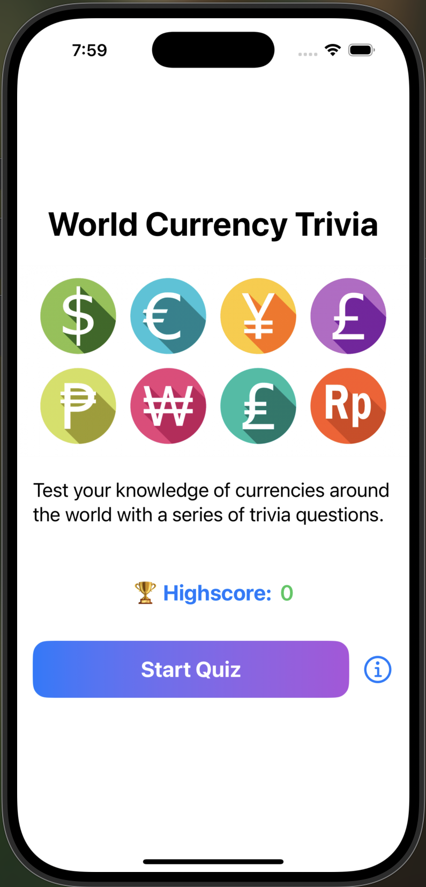
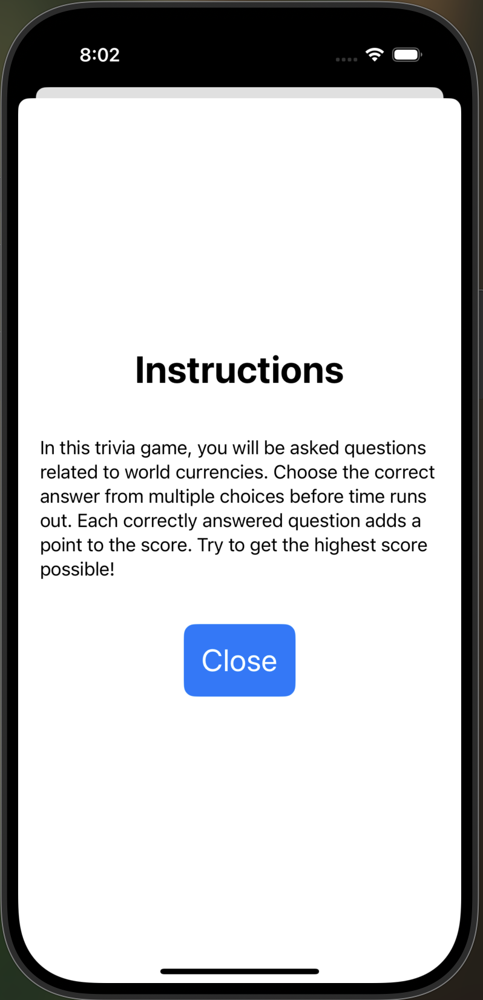
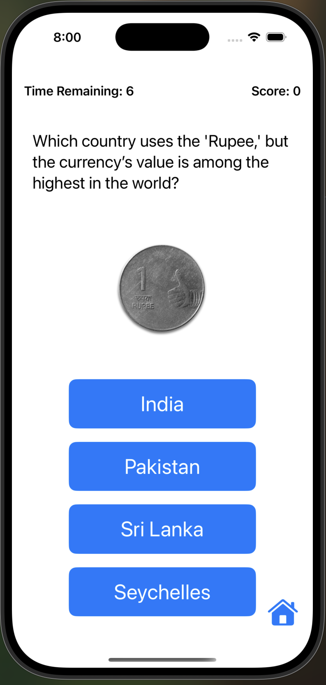
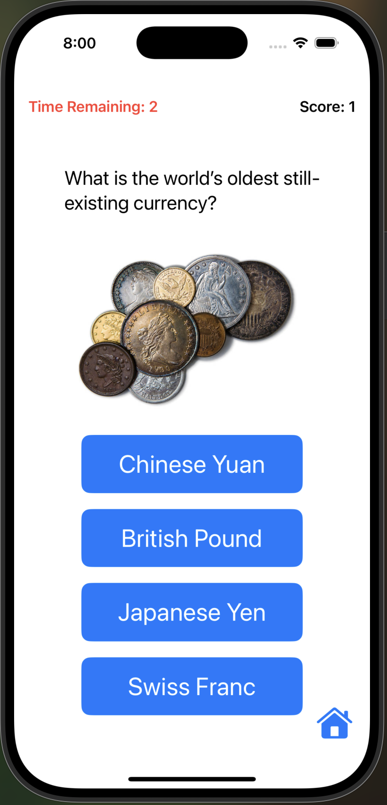
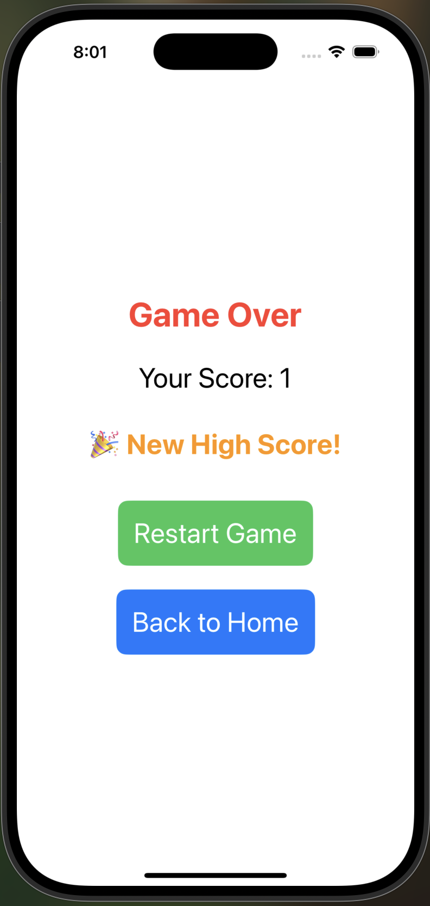

# World Currency Trivia Game

This is an educational and fun quiz iOS app built with SwiftUI. The game challenges players with multiple-choice questions about currencies from around the world.

---

## Features

- 🎯 **10 Currency-Themed Questions** per session  
- ⏱ **10-Second Timer** per question (automatically advances if time runs out)  
- 🧠 **Score Tracking** and immediate feedback  
- 🏆 **High Score Display** on Welcome Screen  
- 🔁 **Game Reset** anytime during or after gameplay  
- 🖼 **Custom Images** for each question  
- 📱 **MVVM Architecture** with `@Observable` ViewModel and structured model  
- 📐 **Adaptive Design** for light/dark modes using SwiftUI

---

## Screens

### Welcome View

- App title, brief instructions, and high score display  
- "Start Quiz" button navigates to the Game View  
- Info button opens a modal with gameplay instructions

  
  

---

### Game View

- One question at a time with image and 4 answer choices  
- Countdown timer and live score tracking  
- Auto-advances on timeout or tap  
- "Back to Home" button available during gameplay

  
  

---

### Game Over View

- Final score summary  
- High score notification (if new record)  
- Options to restart or return to home screen

  

---

## Architecture

- **Models**
  - `Question`: A single trivia item with text, image, choices, and the correct answer.

- **ViewModels**
  - `GameState`: Manages high score and navigation using `NavigationStack`.
  - `QuizViewModel`: Core game logic—question flow, timer, and scoring.

- **Views**
  - `WelcomeView`, `GameView`, `GameOverView`, `InstructionsView`

- **State Management**
  - Uses `@StateObject`, `@EnvironmentObject`, and `@Published`
  - Timer runs via `Timer.scheduledTimer` and resets on question change or game reset

---

## How to Run

1. Open `WorldCurrencyTrivia.xcodeproj` in Xcode 15 on macOS Ventura or later.
2. Build and run the app on a simulator or iOS 16+ device.
3. Tap Start Quiz to begin.
4. Answer each question before time runs out.
5. Review your score and try to beat your high score!

---

## Notes

- High scores are stored in memory only (session-based).
- Game reset clears progress and starts fresh instantly.
